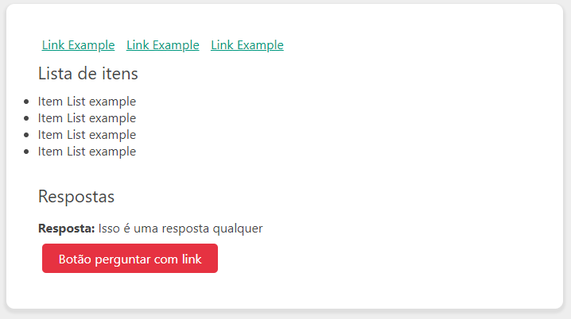

# Relieve CSS3
Um nanoframework para montar o CSS global básico em cima das tags HTML.

O objeto é somente simplificar o desenvolvimento de CRUD backend com um frontend minimamente descente não facilmente escalável, porém, sem a preocupação com saber classes de frameworks como bootstrap, bluma, etc.

Ok, entendi, então como usar?
Adicione o arquivo global.css no seu projeto e use os componentes abaixo:

## Adicionando o framework ao seu projeto
```html
  <link rel="stylesheet" href="relieve.css">
```

## Criando um menu
```html
<nav>
  <a class="active" href="#">Home</a>
  <a href="#">Itens</a>
  <a href="#">Users</a>
</nav>
```


## Criando titulo
```html
<section>
  <div class="container">
    <h1>Titulo do Website</h1>
    <h2>Sub-titulo 1</h2>
    <h3>Sub-titulo 2</h3>
    <h4>Sub-titulo 3</h4>
    <h5>Sub-titulo 4</h5>
    <h6>Sub-titulo 4</h6>
  </div>
</section>
```


## Criando um formulário
```html
<section>
  <div class="container">
    <h1>Preencha seus dados</h1>
    <form action="">

      <label for="name">Name: </label>
      <input type="text" name="name" id="name" placeholder="your name">

      <label for="email">E-mail: </label>
      <input type="email" name="email" id="email" placeholder="your email">

      <label for="password">Password: </label>
      <input type="password" name="password" id="password" placeholder="your password">

      <textarea name="textarea" id="textarea" cols="30" rows="8"></textarea>

      <button>Cadastrar</button><br>
    </form>
  </div>
</section>
```


## Trabalhando com listas
```html
<section>
  <div class="container">
    <a href="#">Link Example</a>
    <a href="#">Link Example</a>
    <a href="#">Link Example</a>
    <br>
    <br>
    <ul>
      <li>Item List example</li>
      <li>Item List example</li>
      <li>Item List example</li>
      <li>Item List example</li>
    </ul>  
  </div>
</section>
```



## Trabalhando com tabelas
```html
<section>
  <div class="container-large">
    <h1>Painel administrador</h1>
    <table>
      <tr>
        <th>id</th>
        <th>foto</th>
        <th>name</th>
        <th>email</th>
        <th>Cargo</th>
        <th>Ações</th>
      </tr>
      <tr>
        <td>1</td>
        <td></td>
        <td>Amy Winehouse</td>
        <td>amy@winehouse.com</td>
        <td>admin</td>
        <td>
          <button class="blue">View</button>
          <button class="green">View 2</button>
          <a class="orange">Edit</a>
          <a class="red" >Delete</a>
        </td>
      </tr>

      <tr>
        <td>2</td>
        <td></td>
        <td>Lisa</td>
        <td>lisa@google.com</td>
        <td>user</td>
        <td>
          <button class="blue">View</button>
          <button class="green">View 2</button>
          <button class="orange">Edit</button>
          <button class="red" >Delete</button>
        </td>
      </tr>
    </table>  
  </div>
</section>
```


## Trabalhando com um footer
```html
<footer>
  <p>Copyrigth@yourName</p>
</footer>
```


Projeto em desenvolvimento
