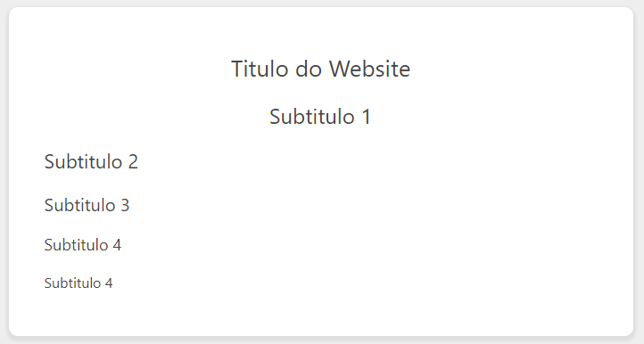
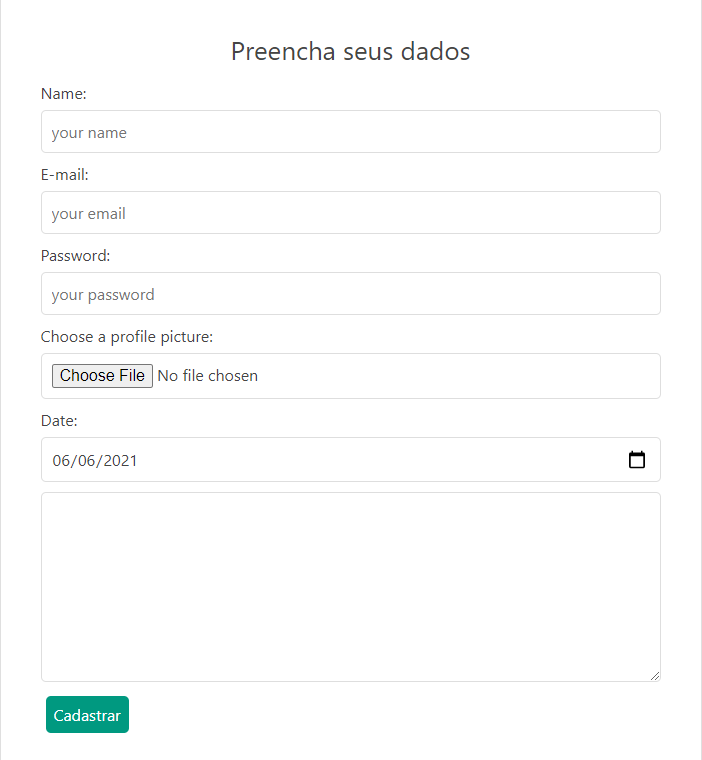
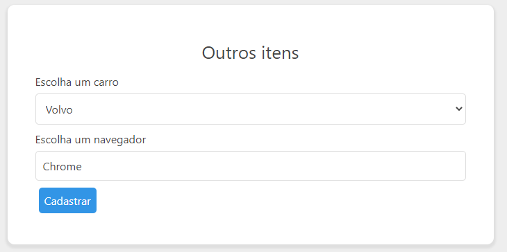
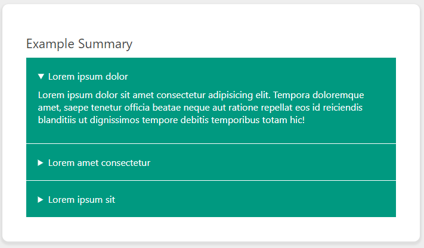
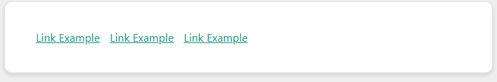
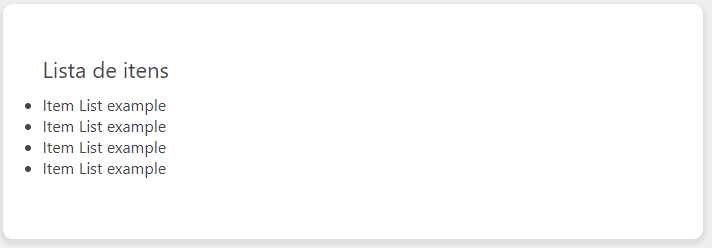
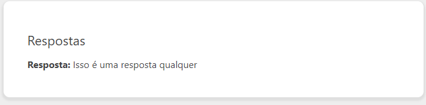
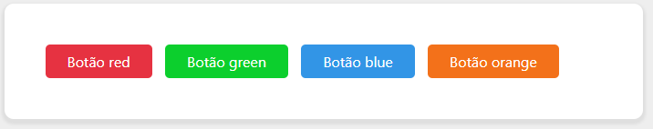
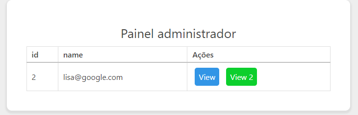
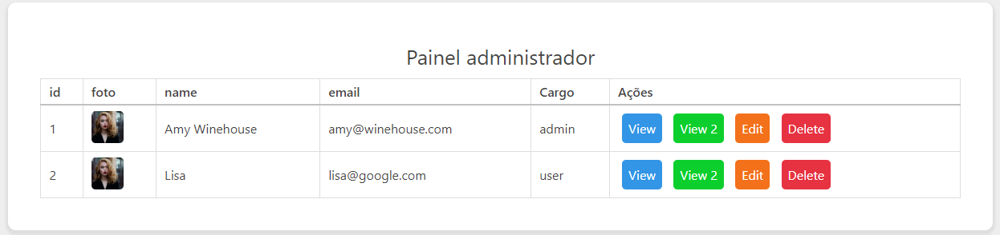

# Relieve CSS3
Um nanoframework para montar o CSS global básico em cima das tags HTML.

O objeto é somente simplificar o desenvolvimento de CRUD backend com um frontend minimamente descente não facilmente escalável, porém, sem a preocupação com saber classes de frameworks como bootstrap, bluma, etc.

Ok, entendi, então como usar?
Adicione o arquivo global.css no seu projeto e use os componentes abaixo:

## Adicionando o framework ao seu projeto
```html
  <link rel="stylesheet" href="relieve.css">
```
## Componentes
### Navbar

```html
<nav>
  <a href="#"></a>
  <a class="active" href="#">Home</a>
  <a href="#">Itens</a>
  <a href="#">Users</a>
</nav>
```

-----------------------------------------------

### breadcrumb

```html
<div class="breadcrumb">
  <a href="#">Posts</a>&gt;
  <a href="#">Edit</a>&gt;
  <a class="active" href="#">User</a>
</div>
```

-----------------------------------------------

### titles

```html
<section>
  <div class="container">
    <h1>Titulo do Website</h1>
    <h2>Subtitulo 1</h2>
    <h3>Subtitulo 2</h3>
    <h4>Subtitulo 3</h4>
    <h5>Subtitulo 4</h5>
    <h6>Subtitulo 4</h6>
  </div>
</section>
```
-----------------------------------------------

### formulary


```html
<section>
  <div class="container">
    <h1>Preencha seus dados</h1>
    <form action="">

      <label for="name">Name: </label>
      <input type="text" name="name" id="name" placeholder="your name">

      <label for="email">E-mail: </label>
      <input type="email" name="email" id="email" placeholder="your email">

      <label for="password">Password: </label>
      <input type="password" name="password" id="password" placeholder="your password">

      <label for="avatar">Choose a profile picture:</label>
      <input type="file" id="avatar" name="avatar" accept="image/png, image/jpeg">
      
      <label for="date">Date: </label>
      <input id="date" lang="por" type="date">

      <textarea name="textarea" id="textarea" cols="30" rows="8"></textarea>

      <button>Cadastrar</button><br>
    </form>
  </div>
</section>
```

-----------------------------------------------
### Select and Datalist


```html
  <section>
    <div class="container">
      <h1>Outros itens</h1>
      <form action="">
        <label for="carros">Escolha um carro</label>
        <select id="carros">
          <option value="volvo">Volvo</option>
          <option value="saab">Saab</option>
          <option value="opel">Opel</option>
          <option value="audi">Audi</option>
        </select>

        <label for="browser">Escolha um navegador</label>
        <input list="browsers" name="browser" id="browser">
        <datalist id="browsers">
          <option value="Edge">
          <option value="Firefox">
          <option value="Chrome">
          <option value="Opera">
          <option value="Safari">
          <option value="Safari2">
        </datalist>

        <button type="submit" class="blue">Cadastrar</button><br>
      </form>
    </div>
  </section>
```

-----------------------------------------------

### Summary


```html
  <section>
    <div class="container">
      <h3>Example Summary</h3>

      <details>
        <summary>Lorem ipsum dolor</summary>
        <p>Lorem ipsum dolor sit amet consectetur adipisicing elit. Tempora doloremque amet, saepe tenetur officia beatae neque aut ratione repellat eos id reiciendis blanditiis ut dignissimos tempore debitis temporibus totam hic!</p>
      </details>

      <details>
        <summary>Lorem amet consectetur</summary>
        <p>Lorem ipsum dolor sit, amet consectetur adipisicing elit. Voluptatum doloribus deserunt quia officiis officia explicabo vel omnis similique! Pariatur aspernatur nobis incidunt architecto amet aut optio dicta vitae ipsam consequuntur?</p>
      </details>

      <details>
        <summary>Lorem ipsum sit</summary>
        <p>Lorem ipsum dolor sit amet consectetur adipisicing elit. Architecto nihil eveniet, vel soluta quidem temporibus unde repudiandae doloremque illo corrupti illum corporis quam nobis! Nulla debitis totam recusandae consequatur sunt!</p>
      </details>

    </div>
  </section>

```

-----------------------------------------------

### Video


```html
  <section>
    <div class="container">
      <h3>Meu video</h3>
      <video controls>
        <source src="videos/video.mp4" type="video/mp4">
        Your browser does not support the video tag.
      </video>

      <p>Este vídeo foi baixado no pixabay, para servir como exemplo para esse demonstrativo. Segue o link <a href="https://pixabay.com/videos/rainy-rain-night-summer-colorful-5278/">https://pixabay.com/videos/rainy-rain-night-summer-colorful-5278/</a></p>
    </div>
  </section>

```
-----------------------------------------------

### Image


```html
  <section>
    <div class="container">
      <h3>Uma imagem qualquer</h3>
      <figure>
        
        <figcaption>Fig.1 - Pescador, Rio, Estação de energia.</figcaption>
      </figure>  
    </div>
  </section>
```
-----------------------------------------------

### Links


```html
  <section>
    <div class="container">
      <a href="#">Link Example</a>
      <a href="#">Link Example</a>
      <a href="#">Link Example</a><br>
    </div>
  </section>
```

-----------------------------------------------

### Lists

```html
<section>
  <div class="container">
    <h3>Lista de itens</h3>
    <ul>
      <li>Item List example</li>
      <li>Item List example</li>
      <li>Item List example</li>
      <li>Item List example</li>
    </ul><br>
  </div>
</section>
```

-----------------------------------------------

### Strong and paragraph

```html
<section>
  <div class="container">
    <h3>Respostas</h1>
    <p><strong>Resposta: </strong> Isso é uma resposta qualquer<br></p>
  </div>
</section>
```

-----------------------------------------------

### Buttons with links

```html
<section>
  <div class="container">
    <button class="red"><a href="#">Botão red</a></button>
    <button class="green"><a href="#">Botão green</a></button>
    <button class="blue"><a href="#">Botão blue</a></button>
    <button class="orange"><a href="#">Botão orange</a></button>
  </div>
</section>
  ```

-----------------------------------------------

### Simple table

```html
<section>
  <div class="container">

    <h1>Painel administrador</h1>
    <table>
      <tr>
        <th>id</th>
        <th>name</th>
        <th>Ações</th>
      </tr>

      <tr>
        <td>2</td>
        <td>lisa@google.com</td>
        <td>
          <button class="blue">View</button>
          <a class="green">View 2</button>
        </td>
      </tr>

    </table>  
  </div>
</section>
```

-----------------------------------------------

### Large tables


```html
<section>
  <div class="container-large">

    <h1>Painel administrador</h1>

    <table>
      <tr>
        <th>id</th>
        <th>foto</th>
        <th>name</th>
        <th>email</th>
        <th>Cargo</th>
        <th>Ações</th>
      </tr>

      <tr>
        <td>1</td>
        <td></td>
        <td>Amy Winehouse</td>
        <td>amy@winehouse.com</td>
        <td>admin</td>
        <td>
          <button class="blue">View</button>
          <button class="green">View 2</button>
          <a class="orange">Edit</a>
          <a class="red" >Delete</a>
        </td>
      </tr>

      <tr>
        <td>2</td>
        <td></td>
        <td>Lisa</td>
        <td>lisa@google.com</td>
        <td>user</td>
        <td>
          <button class="blue">View</button>
          <button class="green">View 2</button>
          <button class="orange">Edit</button>
          <button class="red" >Delete</button>
        </td>
      </tr>
    </table>  
  </div>
</section>
```

-----------------------------------------------

### Footer


```html
<footer>
<p>Copyrigth@yourName</p>
</footer>
```
